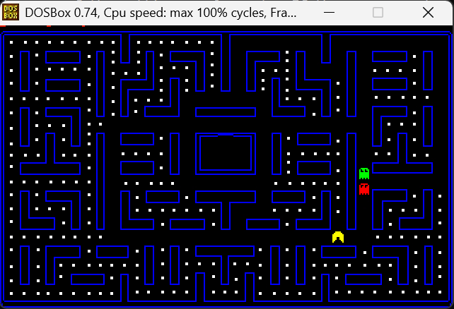

<h1 align="center">Pacman-Assembly-8086</h1>

<p align="center">
  A fully functional Pac-Man clone written from scratch in Assembly 8086, featuring a custom BMP parser and deterministic ghost pathfinding.
</p>

<div align="center">
  
  
</div>


## 🎮 Controls
* **Arrow Keys:** Move Pac-Man (Up, Down, Left, Right).
* **Goal:** Eat all **184 white dots** to clear the level.
* **Avoid:** The Ghosts! You have **3 lives**.
* **Mechanics:** Just like the original, you can pre-turn (press a key before the intersection), and Pac-Man will turn at the first opportunity.

## 🛠 Technical Highlights & Architecture
This project was built to demonstrate low-level understanding of computer architecture. Key implemented features include:

### 1. Custom BMP Image Loader
Instead of drawing the maze line-by-line, the game includes a handwritten parser for BMP files.
* **Header Parsing:** Reads the first 54 bytes to identify the file format.
* **Palette Extraction:** Loads the 1024-byte color palette (256 colors x 4 bytes).
* **BGR to RGB Conversion:** Manually flips the bit order to match the VGA video memory requirements.
* **Rendering:** Prints the image pixel-by-pixel directly to the screen buffer, starting from the bottom-left (as per BMP standard).

### 2. Deterministic Ghost AI (Pathfinding)
The ghosts do not move randomly. They use a **tracking algorithm** to hunt the player:
* **Delta Calculation:** On every move, the ghost calculates the X and Y distance relative to Pac-Man.
* **Axis Prioritization:** The logic prioritizes closing the gap on the larger distance axis first.
* **Collision Logic:** Before moving, the ghost "looks ahead" by checking the color of the next pixel (using `INT 10h`). If it's a wall (Blue pixel), it recalculates an alternative route.

### 3. Direct Video Memory Manipulation
* The game operates in **VGA Mode 13h** (320x200, 256 colors).
* Graphics are rendered by writing directly to video memory segments or using optimized BIOS interrupts (`INT 10h`), ensuring smooth performance on 16-bit architecture.

## 🚀 How to Run
To play the game on a modern machine, you will need a DOS emulator.

1.  **Download & Install** [DOSBox](https://www.dosbox.com/).
2.  **Download** the `PACMAN.EXE` and `World.bmp` files from this repository.
3.  **Mount** the folder in DOSBox:
    ```bash
    mount c c:\path\to\game\folder
    c:
    ```
4.  **Run the game:**
    ```bash
    PACMAN.EXE
    ```

---
*Created by Ori Schwartz as a final high-school project in Computer Science (Assembly 8086).*
